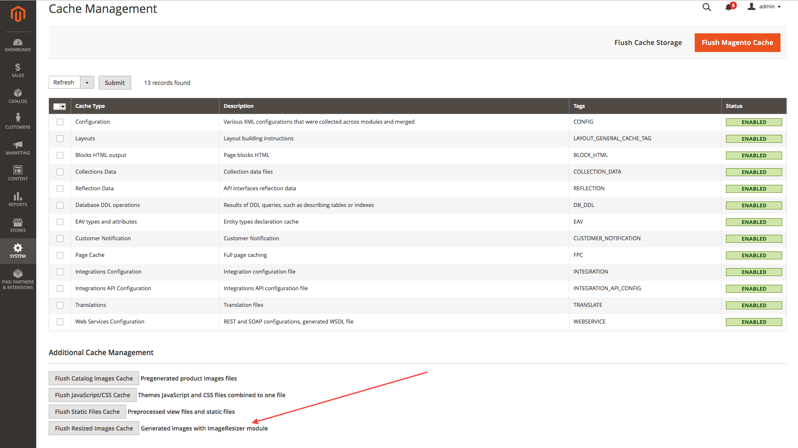

# Magento 2 Image Resizer
[](http://www.repostatus.org/#abandoned)

Magento 2 Module to add simple image resizing capabilities in all blocks and .phtml templates

## Installation

```
$ composer require "staempfli/magento2-module-image-resizer":"~2.0"
```

## Usage

`imageResizer` is automatically available in all frontend Blocks.
You can resize your images just calling a method:

```php
/** @var \Staempfli\ImageResizer\Model\Resizer $imageResizer */
$imageResizer = $block->getImageResizer();
$resizedImageUrl = $imageResizer->resizeAndGetUrl(<originalImageUrl>, $width, $height, [$resizeSettings]);
```

You can do that directly on the .phtml or in your custom Block.

## Cache

Resized images are saved in cache to improve performance. That way, if an image was already resized, we just use the one in cache.

If you need to, you can clear the resized images cache on the Admin Cache Management



## Prerequisites

- PHP >= 7.0.*
- Magento >= 2.1.*

## Resize Settings

The folowing is a list of the resize settings that can be set:
| Name | Default | Type |
| --- | --- | --- |
| constrainOnly | true | Boolean |
| keepAspectRatio | true | Boolean |
| keepTransparency | true | Boolean |
| keepFrame | false | Boolean |
| backgroundColor | null | Array with RGB values ([255,255,255]) |
| quality | 85 | Number 1-100 |
